# MuJoCo Mobility: Reinforcement Learning for Bipedal Locomotion

A reinforcement learning project demonstrating bipedal locomotion in MuJoCo physics simulator, trained using Soft Actor-Critic (SAC) algorithm via Stable Baselines3.

## Overview

This project explores two distinct locomotion challenges:
- **Walking with Constraints**: Learning to walk under increased resistance and damped motion conditions
- **Running**: Learning to run at maximum speed under default physics conditions

## Key Features

- **Algorithm**: Soft Actor-Critic (SAC) - an off-policy deep reinforcement learning algorithm
- **Environment**: MuJoCo physics simulator with humanoid model
- **Framework**: Stable Baselines3 for robust RL implementation
- **Training Duration**: Up to 14 million timesteps for optimal performance

## Training Results

The agent demonstrates progressive learning across millions of training steps, evolving from unstable movements to coordinated bipedal locomotion.

## Visualized Training Progress

<table>
  <tr>
    <td align="center">

### 🚶 Learning to Walk
*With increased resistance and damped motion*

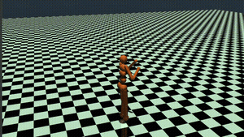<br>
<sub><b>200,000 steps</b> - Initial exploration</sub><br><br>

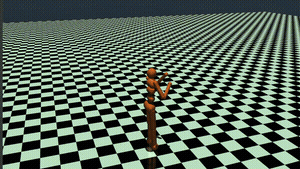<br>
<sub><b>400,000 steps</b> - Finding balance</sub><br><br>

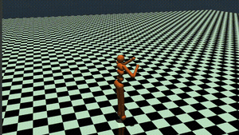<br>
<sub><b>1,000,000 steps</b> - Basic coordination</sub><br><br>

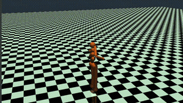<br>
<sub><b>2,000,000 steps</b> - Improved stability</sub><br><br>

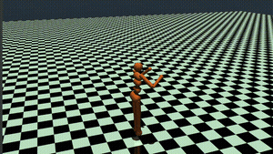<br>
<sub><b>4,000,000 steps</b> - Developing gait</sub><br><br>

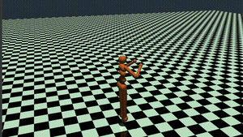<br>
<sub><b>6,000,000 steps</b> - Refined movement</sub><br><br>

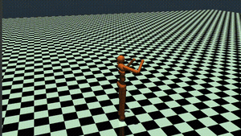<br>
<sub><b>8,000,000 steps</b> - Consistent walking</sub><br><br>

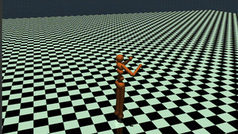<br>
<sub><b>14,000,000 steps</b> - Optimal performance</sub><br><br>

</td>
<td align="center">

### 🏃 Learning to Run
*With default physics conditions*

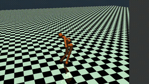<br>
<sub><b>1,000,000 steps</b> - Early attempts</sub><br><br>

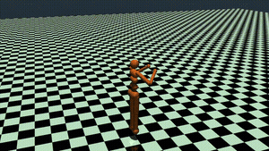<br>
<sub><b>2,000,000 steps</b> - Speed development</sub><br><br>

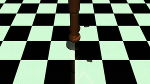<br>
<sub><b>4,000,000 steps</b> - Running form</sub><br><br>

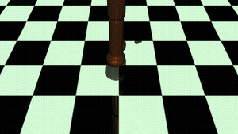<br>
<sub><b>8,000,000 steps</b> - Efficient stride</sub><br><br>

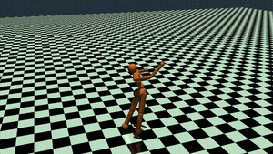<br>
<sub><b>13,000,000 steps</b> - Peak performance</sub><br><br>

</td>
</tr>
</table>

## Technical Details

### Training Configuration
- **Algorithm**: SAC (Soft Actor-Critic)
- **Framework**: Stable Baselines3
- **Physics Engine**: MuJoCo
- **Model**: Humanoid bipedal robot

### Environment Parameters
- **Walking Task**: Modified with increased joint resistance and motion damping
- **Running Task**: Standard physics parameters optimized for speed

## Requirements

```bash
pip install stable-baselines3[extra]
pip install mujoco
pip install gymnasium
```

## Usage

```python
# Example training code
from stable_baselines3 import SAC
import gymnasium as gym

# Create environment
env = gym.make('Humanoid-v4')

# Initialize SAC model
model = SAC('MlpPolicy', env, verbose=1)

# Train the model
model.learn(total_timesteps=1000000)
```

## Performance Notes

The training demonstrates clear progression:
- **Early stages (< 1M steps)**: Agent learns basic balance and coordination
- **Mid stages (1M - 4M steps)**: Development of consistent locomotion patterns
- **Late stages (> 4M steps)**: Optimization and refinement of movements

## Future Improvements

- [ ] Implement curriculum learning for faster convergence
- [ ] Explore different reward shaping strategies
- [ ] Test transfer learning between walking and running tasks
- [ ] Add obstacle navigation capabilities

## License

This project is for educational and research purposes.

## Acknowledgments

- [Stable Baselines3](https://stable-baselines3.readthedocs.io/) for the RL implementation
- [MuJoCo](https://mujoco.org/) for the physics simulation
- [OpenAI Gym/Gymnasium](https://gymnasium.farama.org/) for the environment interface